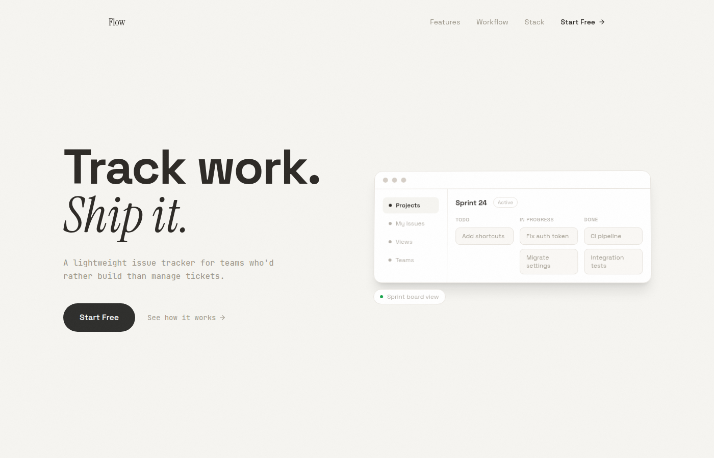
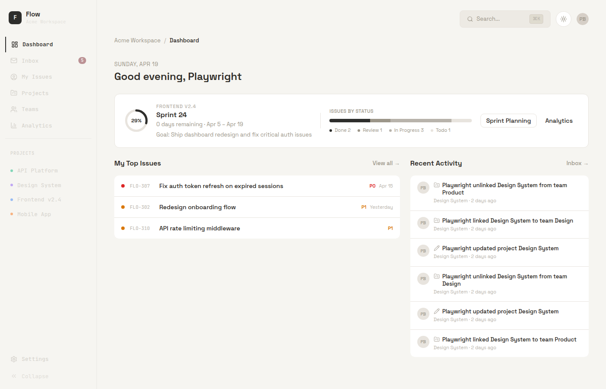
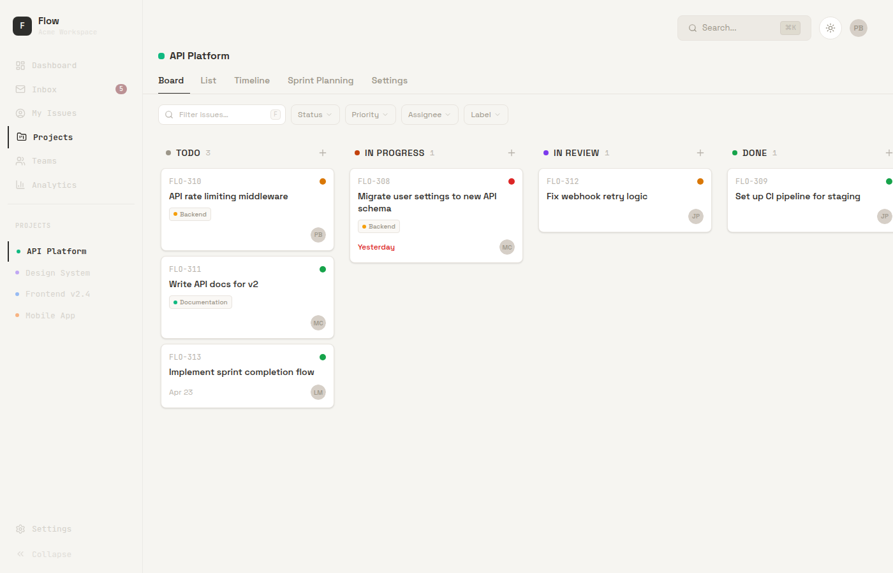
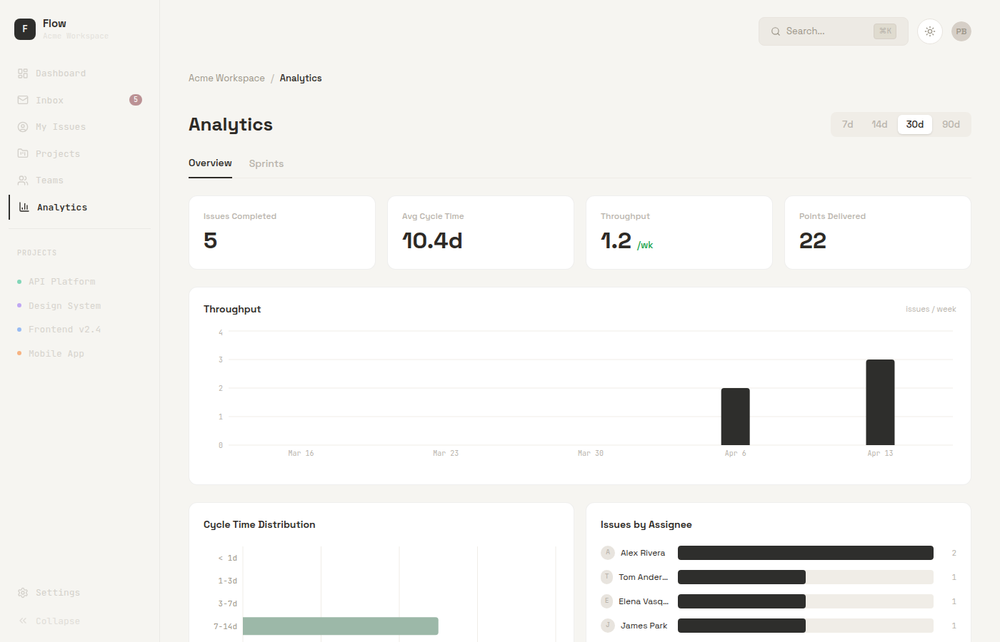

# Flow

> A lightweight issue tracker for teams who'd rather build than manage tickets.



## About

Flow is a project management app for small product teams — projects, sprints, issues, and analytics in one place. The middle ground between Jira's paperwork and Linear's weight: fast enough to capture work without friction, structured enough to actually ship it.

It's a complete working product — auth, real-time updates, row-level security, drag-and-drop boards, sprint planning, analytics, and an opinionated visual design.

## A tour

### Dashboard — what's happening right now

The first thing you see: active sprint, your top issues, and a live activity feed from the team.



### Board — drag, drop, ship

A kanban board with filtering by status, priority, assignee, and label. Drag-and-drop powered by dnd-kit, with optimistic updates so the board never feels laggy.



### Analytics — how the team is actually shipping

Throughput, cycle time, cycle-time distribution, and per-assignee delivery. Server-computed aggregations, rendered with Recharts.



### Inbox — zero noise

Notifications for everything happening on issues you care about. Filter by assigned vs. all; mark all as read in one click.


## Built with

- **Frontend** — Next.js 16 · React 19 · TypeScript · Tailwind v4 · GSAP + Lenis for motion
- **Backend** — Supabase (Postgres · Auth · Row-Level Security) · Server Actions · Realtime channels
- **Editor & UX** — TipTap rich text · Radix primitives · dnd-kit · cmdk command palette · Recharts

## Run it locally

```bash
git clone https://github.com/rayanxn/Flow.git
cd Flow
npm install
cp .env.local.example .env.local   # fill in your Supabase keys
npm run dev
```

Open [localhost:3000](http://localhost:3000).

To seed a realistic workspace (4 projects, 20 issues, 3 teams, notifications):

```bash
npx tsx scripts/seed-test-data.ts
```

---

Built by [@rayanxn](https://github.com/rayanxn) as a senior project.
